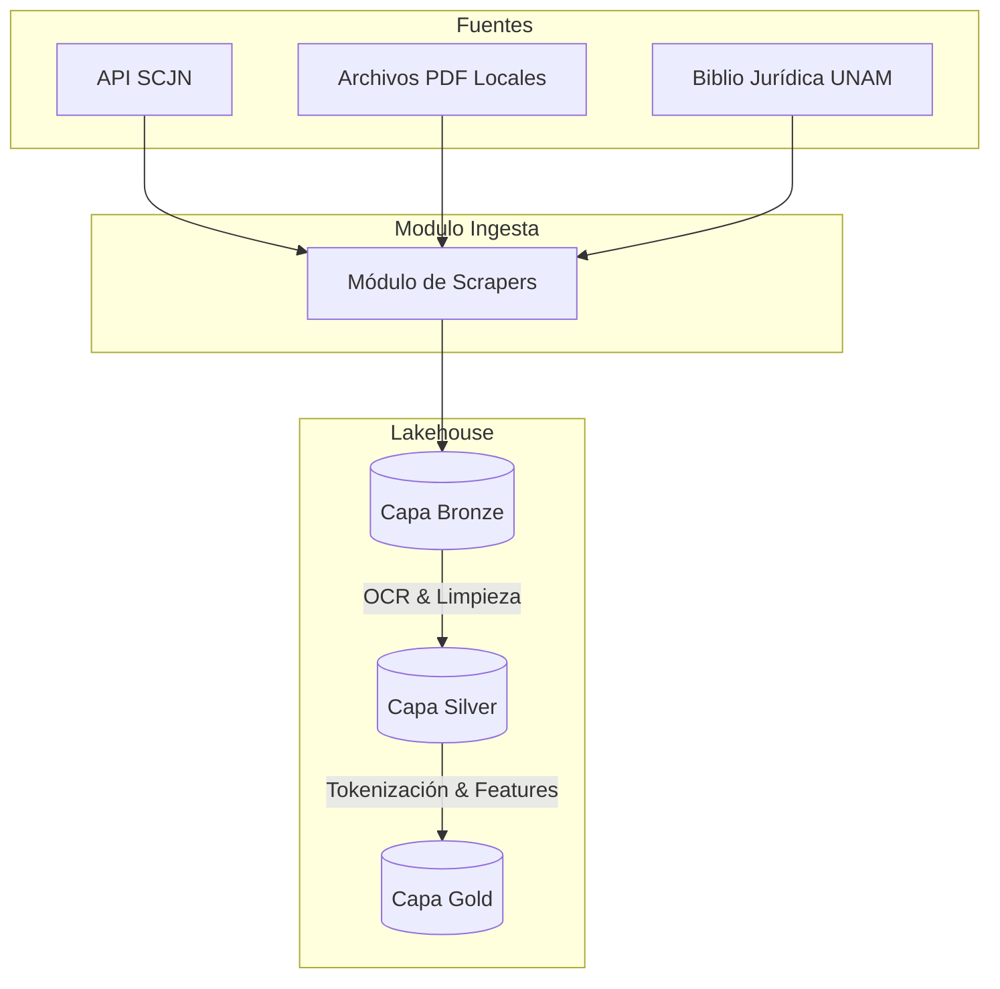
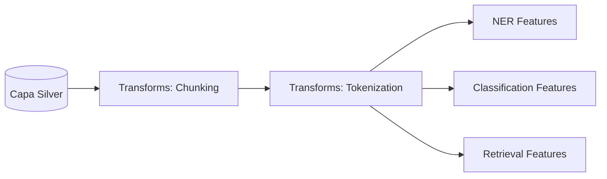

# Arquitectura del Sistema

BETO Legal México implementa una arquitectura **Medallion (Lakehouse)** integrada con un stack completo de MLOps para la puesta en producción.

## 1. Data Pipeline (Ingesta a Gold)

La ingesta se compone de extractores automatizados que recolectan resoluciones de la SCJN y documentos de repositorios universitarios, volcándolos inicialmente en bruto.

## 2. Feature Engineering

En la capa Silver, se aplican transformaciones clave antes de la etapa de modelado. Esto incluye la fragmentación contextual de largos textos legales (Chunking) y la inyección de aumentación de datos (Augmentation).

## 3. Serving y MLOps

La orquestación general está administrada por **Airflow**. En tiempo de ejecución, una API RESTful (**FastAPI**) provee inferencia síncrona, apoyada por una cola de tareas (**Celery workers**) para procesamiento asíncrono o inferencia en batch, mientras métricas críticas fluyen hacia **Prometheus** y **Grafana**.
